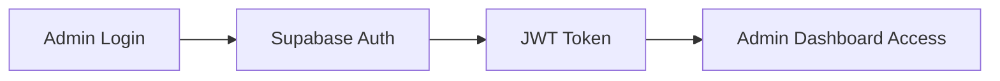
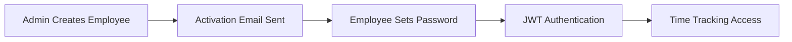

# SolidTracker Application

A comprehensive employee time tracking system with screenshot monitoring, built with modern web technologies and a desktop application for seamless employee experience.

## 🚀 Overview

SolidTracker provides:

- **Admin Web Dashboard** - Manage employees, projects, tasks, and view time reports
- **Employee Desktop Application** - Time tracking with automatic screenshot capture
- **Employee Web Interface** - Browser-based time tracking alternative
- **Real-time Updates** - Live synchronization across all applications
- **Screenshot Monitoring** - Automatic screenshot capture during work sessions
- **JWT Authentication** - Secure token-based authentication system

## 🏗️ Architecture

This is a **Turborepo** monorepo containing multiple applications and shared packages:

```
solidtracker/
├── apps/
│   ├── web/                 # Admin web dashboard (Next.js) - Port 3000
│   ├── desktop-web/         # Employee web interface (Next.js) - Port 3001
│   └── desktop/             # Electron desktop app
├── packages/
│   ├── ui/                  # Shared React components
│   ├── api/                 # API utilities and clients
│   ├── db/                  # Database utilities
│   ├── validation/          # Zod validation schemas
│   ├── eslint-config/       # ESLint configurations
│   └── typescript-config/   # TypeScript configurations
└── supabase/               # Database schema and setup
```

## 🛠️ Technology Stack

- **Frontend**: Next.js 15, React 19, TypeScript, Tailwind CSS
- **Backend**: Supabase (PostgreSQL + Real-time + Auth + Storage)
- **Desktop**: Electron.js
- **Build System**: Turborepo
- **Authentication**: Supabase Auth with JWT tokens
- **File Storage**: Supabase Storage (for screenshots)
- **Styling**: Tailwind CSS with custom UI components
- **Forms**: React Hook Form with Zod validation

## 📋 Prerequisites

Before starting, ensure you have:

- **Node.js** 18+ ([Download here](https://nodejs.org/))
- **npm** 10.2.4+ (comes with Node.js)
- **Git** ([Download here](https://git-scm.com/))
- **Supabase Account** ([Sign up here](https://supabase.com))
- **Code Editor** (VS Code recommended)

### System Requirements
- **Windows**: Windows 10/11
- **macOS**: macOS 10.15+
- **Linux**: Ubuntu 18.04+ or equivalent

## 🚀 Quick Start (5 Minutes Setup)

### Step 1: Clone and Install

```bash
# Clone the repository
git clone <repository-url>
cd SolidTracker

# Install all dependencies (this may take a few minutes)
npm install
```

### Step 2: Set Up Supabase Database

1. **Create Supabase Project**:
   - Go to [supabase.com](https://supabase.com)
   - Click "New Project" 
   - Name: `solidtracker`
   - Choose region closest to you
   - Generate a secure database password
   - Click "Create new project" (takes ~2 minutes)

2. **Set Up Database Schema**:
   ```bash
   # In your Supabase project dashboard:
   # 1. Go to SQL Editor
   # 2. Copy contents of supabase/schema.sql
   # 3. Paste and click "RUN"
   ```

3. **Get Your API Keys**:
   - Go to Settings → API in your Supabase dashboard
   - Copy the Project URL and anon public key

### Step 3: Configure Environment Variables

Each app needs its own `.env.local` file. Create these three files:

#### 1. Admin Web App: `apps/web/.env.local`
```bash
# Supabase Configuration (REQUIRED)
NEXT_PUBLIC_SUPABASE_URL="https://your-project-id.supabase.co"
NEXT_PUBLIC_SUPABASE_ANON_KEY="your-anon-key-here"

# App Configuration (REQUIRED)
NEXT_PUBLIC_APP_URL="http://localhost:3000"

# Admin Features (OPTIONAL)
SUPABASE_SERVICE_ROLE_KEY="your-service-role-key"

# Email Configuration (OPTIONAL - for employee invitations)
EMAIL_FROM="noreply@yourcompany.com"
SMTP_HOST="smtp.gmail.com"
SMTP_PORT="587"
SMTP_USER="your-email@gmail.com"
SMTP_PASSWORD="your-app-password"
```

#### 2. Employee Web App: `apps/desktop-web/.env.local`
```bash
# Supabase Configuration (REQUIRED)
NEXT_PUBLIC_SUPABASE_URL="https://your-project-id.supabase.co"
NEXT_PUBLIC_SUPABASE_ANON_KEY="your-anon-key-here"

# App Configuration (REQUIRED)
NEXT_PUBLIC_APP_URL="http://localhost:3001"
   ```

#### 3. Desktop Electron App: `apps/desktop/.env.local`
```bash
# Supabase Configuration (REQUIRED)
NEXT_PUBLIC_SUPABASE_URL="https://your-project-id.supabase.co"
NEXT_PUBLIC_SUPABASE_ANON_KEY="your-anon-key-here"

# Desktop App Configuration
NEXT_PUBLIC_APP_URL="http://localhost:3001"
```

**Quick Setup Script:**
```bash
# Create all environment files at once
touch apps/web/.env.local
touch apps/desktop-web/.env.local
touch apps/desktop/.env.local

# Copy the templates above into each file, then edit with your Supabase credentials
```

> **💡 Need help with environment setup?** See detailed instructions in [SUPABASE_SETUP.md](./SUPABASE_SETUP.md)

### Step 4: Start the Application

```bash
# Start both admin and employee interfaces
npm run dev:web &
npm run dev:desktop &

# OR start them individually:
npm run dev:web          # Admin Dashboard (port 3000)
npm run dev:desktop      # Employee Interface (port 3001)
```

### Step 5: Access & Test

1. **Admin Dashboard**: Open [http://localhost:3000](http://localhost:3000)
2. **Employee Interface**: Open [http://localhost:3001](http://localhost:3001)

**First Time Setup:**
1. Create an admin user in Supabase Dashboard → Authentication → Users
2. Login to admin dashboard and create your first employee
3. Test employee login on port 3001

## 📱 Available Applications

### 🖥️ Admin Dashboard (Port 3000)
**URL**: [http://localhost:3000](http://localhost:3000)

**Features**:
  - Employee management and onboarding
  - Project and task creation
  - Time reports and analytics
  - Screenshot monitoring dashboard
  - Employee activation system

**Default Login**: Create admin user in Supabase dashboard

### 👨‍💻 Employee Interface (Port 3001)
**URL**: [http://localhost:3001](http://localhost:3001)

**Features**:
  - Time tracking with start/stop functionality
  - Project and task selection
  - Real-time timer display
  - Screenshot capture integration

**Login**: Use employee credentials created by admin

### 🖥️ Desktop App (Electron)
**Coming Soon**: Native desktop application for enhanced screenshot monitoring

## 🗂️ Project Structure Deep Dive

### Core Applications

```
apps/
├── web/                    # Admin Dashboard (Next.js)
│   ├── app/
│   │   ├── dashboard/      # Main admin interface
│   │   ├── employees/      # Employee management
│   │   ├── projects/       # Project management
│   │   ├── screenshots/    # Activity monitoring
│   │   └── login/          # Admin authentication
│   └── package.json
│
├── desktop-web/            # Employee Interface (Next.js)
│   ├── app/
│   │   ├── dashboard/      # Employee dashboard
│   │   └── login/          # Employee authentication
│   └── package.json
│
└── desktop/                # Electron App
    ├── main.js             # Electron main process
    └── package.json
```

### Shared Packages

```
packages/
├── ui/                     # React Components
│   ├── src/
│   │   ├── button.tsx      # Button component
│   │   ├── card.tsx        # Card layouts
│   │   ├── input.tsx       # Form inputs
│   │   └── table.tsx       # Data tables
│   └── package.json
│
├── api/                    # API Layer
│   ├── index.ts            # Supabase client & API methods
│   └── package.json
│
├── db/                     # Database Types
│   ├── index.ts            # TypeScript database types
│   └── package.json
│
└── validation/             # Form Validation
    ├── index.ts            # Zod schemas
    └── package.json
```

## 🎯 Key Features

### For Administrators
- ✅ **Employee Onboarding**: Streamlined employee activation via email
- ✅ **Project Management**: Create projects with hourly rates
- ✅ **Task Organization**: Define tasks within projects
- ✅ **Time Analytics**: Detailed time reports with filtering
- ✅ **Activity Monitoring**: Real-time screenshot monitoring
- ✅ **Team Overview**: Live dashboard of employee activity

### For Employees
- ✅ **Simple Time Tracking**: One-click start/stop with project selection
- ✅ **Web & Desktop**: Choose your preferred interface
- ✅ **Automatic Screenshots**: Background monitoring during work
- ✅ **Real-time Sync**: Instant synchronization across devices
- ✅ **Project Selection**: Easy project and task switching

## 🔐 Authentication & Security

### Admin Authentication


### Employee Onboarding


**Security Features**:
- 🔒 **Row Level Security (RLS)**: Data isolation between employees
- 🔑 **JWT Tokens**: Secure API authentication
- 📧 **Email Verification**: Employee activation via email
- 🖼️ **Secure Storage**: Screenshot encryption and access control
- 🌐 **HTTPS Required**: Production security standards

## 📊 Database Schema

```sql
-- Core Tables
employees         # Employee profiles and auth
projects          # Project definitions with rates
tasks            # Tasks within projects
time_entries     # Time tracking records
screenshots      # Screenshot metadata
devices          # Employee device registration
admins           # Administrator accounts

-- Relationship Tables  
project_assignments    # Employee-project relationships
task_assignments      # Employee-task relationships
```

## 🔧 Development Commands

```bash
# Installation
npm install                 # Install all dependencies
npm run clean              # Clean node_modules and reinstall

# Development
npm run dev:web            # Start admin dashboard (port 3000)
npm run dev:desktop        # Start employee interface (port 3001)

# Code Quality
npm run lint               # Run ESLint on all packages
npm run format             # Format code with Prettier
npm run check-types        # TypeScript type checking

# Building
npm run build              # Build all applications
npm run build:win          # Build Electron app for Windows
npm run build:mac          # Build Electron app for macOS
npm run build:linux        # Build Electron app for Linux
```

## 🚀 Production Deployment

### Web Applications
**Recommended Platforms**: Vercel, Netlify, Railway

```bash
# Build for production
npm run build

# Deploy admin dashboard
cd apps/web && npm run start

# Deploy employee interface  
cd apps/desktop-web && npm run start
```

**Environment Variables for Production**:
- Create production `.env.local` files in each app directory
- Update `NEXT_PUBLIC_APP_URL` to your production domains
- Configure Supabase CORS settings for production URLs
- Set up custom domain SSL certificates

### Database (Supabase)
- ✅ **Auto-scaling**: Supabase handles traffic automatically
- ✅ **Backups**: Daily automated backups
- ✅ **Monitoring**: Built-in performance monitoring
- ✅ **Security**: Production-ready RLS policies

## 🐛 Troubleshooting Guide

### Common Setup Issues

**1. Supabase Connection Errors**
```bash
# Check environment variables in each app
cat apps/web/.env.local
cat apps/desktop-web/.env.local
cat apps/desktop/.env.local

# Verify Supabase project status
# Go to dashboard.supabase.com
```

**2. Port Already in Use**
```bash
# Kill processes on ports 3000/3001
npx kill-port 3000
npx kill-port 3001

# Or change ports in package.json
```

**3. Database Schema Issues**
```bash
# Reset database in Supabase Dashboard:
# SQL Editor → Run: DROP SCHEMA public CASCADE; CREATE SCHEMA public;
# Then re-run schema.sql
```

**4. Build Errors**
```bash
# Clear everything and reinstall
rm -rf node_modules package-lock.json
npm install

# Clear Turbo cache
npx turbo clean
```

**5. TypeScript Errors**
```bash
# Check types across all packages
npm run check-types

# Restart TypeScript server in VS Code
# Cmd+Shift+P → "TypeScript: Restart TS Server"
```

### Getting Help

1. **Check Environment**: Ensure all `.env.local` files in each app directory are correct
2. **Database Status**: Verify Supabase project is active
3. **Console Logs**: Check browser console for error details
4. **Network Tab**: Verify API calls are reaching Supabase
5. **Supabase Logs**: Check logs in Supabase dashboard

## 🤝 Contributing

1. **Fork** the repository
2. **Create** a feature branch: `git checkout -b feature/amazing-feature`
3. **Test** your changes thoroughly
4. **Commit** with clear messages: `git commit -m 'Add amazing feature'`
5. **Push** to your fork: `git push origin feature/amazing-feature`
6. **Create** a Pull Request

### Development Guidelines
- Follow existing code style and patterns
- Add TypeScript types for new features
- Test both admin and employee interfaces
- Update documentation for new features

## 📝 License

This project is proprietary software. All rights reserved.

## 🎯 What's Next?

After setup, try these workflows:

1. **Admin Workflow**:
   - Login to admin dashboard
   - Create a project with tasks
   - Add an employee and send activation
   - Monitor time tracking activity

2. **Employee Workflow**:
   - Receive activation email
   - Set password and login
   - Start time tracking on projects
   - View time logs and screenshots

3. **Advanced Features**:
   - Set up email notifications
   - Configure screenshot intervals
   - Export time reports
   - Build desktop Electron app

## 📞 Support

- 🐛 **Bug Reports**: Create an issue with reproduction steps
- 💡 **Feature Requests**: Describe your use case and requirements  
- 📖 **Documentation**: Check SUPABASE_SETUP.md for detailed setup
- 💬 **Questions**: Contact the development team

---

**Happy Time Tracking with SolidTracker! ⏰**
