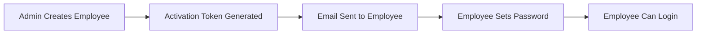

# SolidTracker - Supabase Setup Guide

Complete guide to set up Supabase database for SolidTracker application in under 10 minutes.

## 🎯 What You'll Accomplish

By the end of this guide, you'll have:
- ✅ A fully configured Supabase project
- ✅ Database schema with all tables and security policies
- ✅ API keys for local development
- ✅ Authentication system ready for admin and employee logins
- ✅ Secure file storage for screenshots

## 📋 Prerequisites

- Supabase account ([Sign up free](https://supabase.com))
- Email address for project notifications
- 5-10 minutes of setup time

## 🚀 Step-by-Step Setup

### Step 1: Create Supabase Project (2 minutes)

1. **Go to Supabase Dashboard**
   - Visit [supabase.com](https://supabase.com)
   - Click "Start your project" or "New Project"

2. **Select Organization**
   - Choose your personal organization or create a new one

3. **Configure Project**
   ```
   Project Name: SolidTracker
   Database Password: [Generate a strong password - save it!]
   Region: [Choose closest to your location]
   Pricing Plan: Free tier (perfect for development)
   ```

4. **Create Project**
   - Click "Create new project"
   - ⏱️ Wait 2-3 minutes for setup completion
   - You'll see a "Project is ready" notification

### Step 2: Set Up Database Schema (2 minutes)

1. **Access SQL Editor**
   - In your Supabase dashboard, click "SQL Editor" in the sidebar
   - Click "New query"

2. **Execute Schema**
   - Copy the entire contents of `supabase/schema.sql` from your project
   - Paste it into the SQL editor
   - Click "RUN" button
   - ✅ You should see "Success. No rows returned" message

3. **Verify Tables Created**
   - Go to "Table Editor" in sidebar
   - You should see these tables:
     ```
     ✅ employees
     ✅ projects  
     ✅ tasks
     ✅ time_entries
     ✅ screenshots
     ✅ devices
     ✅ admins
     ✅ project_assignments
     ✅ task_assignments
     ```

### Step 3: Get API Credentials (1 minute)

1. **Navigate to API Settings**
   - Go to "Settings" → "API" in sidebar

2. **Copy Required Values**
   ```bash
   # Project URL (needed)
   Project URL: https://xxxxxxxxx.supabase.co
   
   # Public API Key (needed)
   anon public: eyJhbGciOiJIUzI1NiIsInR5cCI6IkpXVCJ9...
   
   # Service Role Key (optional, for admin features)
   service_role: eyJhbGciOiJIUzI1NiIsInR5cCI6IkpXVCJ9...
   ```

3. **Important**: Keep these values secure - don't commit them to git!

### Step 4: Configure Environment Variables (2 minutes)

1. **Create Environment Files**
   - Each SolidTracker app needs its own `.env.local` file
   - Create three separate files for the three apps

2. **Admin Web App**: `apps/web/.env.local`
   ```bash
   # Supabase Configuration (REQUIRED)
   NEXT_PUBLIC_SUPABASE_URL="https://your-project-id.supabase.co"
   NEXT_PUBLIC_SUPABASE_ANON_KEY="your-anon-key-here"
   
   # App Configuration (REQUIRED)
   NEXT_PUBLIC_APP_URL="http://localhost:3000"
   
   # Advanced Features (OPTIONAL)
   SUPABASE_SERVICE_ROLE_KEY="your-service-role-key"
   
   # Email Configuration (OPTIONAL - for employee invitations)
   EMAIL_FROM="noreply@yourcompany.com"
   SMTP_HOST="smtp.gmail.com"
   SMTP_PORT="587"
   SMTP_USER="your-email@gmail.com"
   SMTP_PASSWORD="your-app-password"
   ```

3. **Employee Web App**: `apps/desktop-web/.env.local`
   ```bash
   # Supabase Configuration (REQUIRED)
   NEXT_PUBLIC_SUPABASE_URL="https://your-project-id.supabase.co"
   NEXT_PUBLIC_SUPABASE_ANON_KEY="your-anon-key-here"
   
   # App Configuration (REQUIRED)
   NEXT_PUBLIC_APP_URL="http://localhost:3001"
   ```

4. **Desktop Electron App**: `apps/desktop/.env.local`
   ```bash
   # Supabase Configuration (REQUIRED)
   NEXT_PUBLIC_SUPABASE_URL="https://your-project-id.supabase.co"
   NEXT_PUBLIC_SUPABASE_ANON_KEY="your-anon-key-here"
   
   # Desktop App Configuration
   NEXT_PUBLIC_APP_URL="http://localhost:3001"
   ```

5. **Replace Placeholder Values**
   - Replace `your-project-id` with your actual Supabase project ID
   - Replace `your-anon-key-here` with your copied anon key
   - Replace `your-service-role-key` with your service role key

### Step 5: Test Database Connection (2 minutes)

1. **Start SolidTracker**
```bash
   npm run dev:web
   ```

2. **Check Connection**
   - Open [http://localhost:3000](http://localhost:3000)
   - You should see the login page without errors
   - Check browser console (F12) - no Supabase errors should appear

3. **Test Database Access**
   - Go to Supabase dashboard → "Table Editor" → "employees"
   - Click "Insert" → "Insert row"
   - Add a test row to verify database write access

## 🔐 Authentication Setup

### Admin User Creation

1. **Create First Admin**
   - In Supabase dashboard: "Authentication" → "Users"
   - Click "Add user" 
   - Enter email/password
   - Click "Create user"

2. **Add Admin Record**
   - Go to "Table Editor" → "admins"
   - Click "Insert row"
   - Fill in: `email` (same as auth user), `name`
   - Click "Save"

3. **Test Admin Login**
   - Go to [http://localhost:3000](http://localhost:3000)
   - Login with admin credentials
   - Should reach dashboard successfully

### Employee Authentication Flow

SolidTracker uses a secure employee onboarding process:



**How it works:**
1. Admin creates employee record with activation token
2. Employee receives email with secure activation link
3. Employee sets password using token
4. Employee can login to time tracking interface

## 📦 Storage Configuration

SolidTracker automatically configures file storage for screenshots:

### Storage Bucket Setup
- ✅ **Bucket Name**: `screenshots`
- ✅ **Access**: Private (employees can only access their own)
- ✅ **Security**: Row Level Security policies applied
- ✅ **File Types**: PNG, JPEG images

### Security Policies
```sql
-- Employees can only upload their own screenshots
CREATE POLICY "Employees can upload screenshots" ON storage.objects
FOR INSERT WITH CHECK (bucket_id = 'screenshots' AND auth.uid()::text = (storage.foldername(name))[1]);

-- Employees can only view their own screenshots  
CREATE POLICY "Employees can view own screenshots" ON storage.objects
FOR SELECT USING (bucket_id = 'screenshots' AND auth.uid()::text = (storage.foldername(name))[1]);
```

## 🔧 Advanced Configuration

### Real-time Features

SolidTracker uses Supabase real-time for live updates:

```javascript
// Automatic setup - no additional configuration needed
- Live timer updates
- Real-time screenshot notifications
- Employee status changes
- Project/task updates
```

### Row Level Security (RLS)

Database security is automatically configured:

- **Admins**: Full access to all data
- **Employees**: Access only to their own records
- **Public**: No direct database access
- **API**: Secured with JWT tokens

### Performance Optimization

For production deployments:

1. **Database Indexes**
   ```sql
   -- Automatically created by schema.sql
   CREATE INDEX idx_time_entries_employee ON time_entries(employee_id);
   CREATE INDEX idx_screenshots_employee ON screenshots(employee_id);
   ```

2. **Connection Pooling**
   - Supabase handles automatically
   - Up to 60 concurrent connections on free tier

## 🐛 Troubleshooting

### Common Setup Issues

**❌ "Failed to connect to Supabase"**
```bash
# Check your environment variables
cat .env.local

# Verify Supabase project is active
# Dashboard should show "Project is healthy"
```

**❌ "Schema execution failed"**
```bash
# Reset database (WARNING: Deletes all data)
# In Supabase SQL Editor:
DROP SCHEMA public CASCADE; 
CREATE SCHEMA public;

# Then re-run schema.sql
```

**❌ "Authentication error"**
```bash
# Check if admin user exists:
# Supabase Dashboard → Authentication → Users
# Should see your admin email listed

# Check if admin record exists:
# Table Editor → admins → should see matching email
```

**❌ "RLS policy error"**
```bash
# Verify RLS is enabled:
# Table Editor → Click table → Settings
# "Enable Row Level Security" should be checked
```

### Environment Variable Issues

**Check Variables Are Loaded**
```bash
# Check environment files exist in each app
ls -la apps/web/.env.local
ls -la apps/desktop-web/.env.local
ls -la apps/desktop/.env.local

# Debug in browser console (add to any page)
console.log('Supabase URL:', process.env.NEXT_PUBLIC_SUPABASE_URL);
console.log('Supabase Key:', process.env.NEXT_PUBLIC_SUPABASE_ANON_KEY ? 'Present' : 'Missing');
```

**Common Mistakes**
- ❌ Missing `NEXT_PUBLIC_` prefix
- ❌ Quotes around environment values
- ❌ Spaces in variable names
- ❌ Using production URLs in development

### Database Connection Issues

**Test Connection Manually**
```bash
# Install Supabase CLI
npm install -g @supabase/cli

# Test connection
supabase db ping --project-ref your-project-id
```

**Check Project Status**
- Supabase Dashboard → Project should show "Healthy"
- No maintenance or downtime notifications
- Database queries respond within reasonable time

## 🚀 Production Deployment

### Environment Setup

**Production Environment Variables**
```bash
# Production Supabase Project
NEXT_PUBLIC_SUPABASE_URL="https://your-prod-project.supabase.co"
NEXT_PUBLIC_SUPABASE_ANON_KEY="prod-anon-key"

# Production App URL
NEXT_PUBLIC_APP_URL="https://solidtracker.yourcompany.com"

# Email Configuration (Required for production)
EMAIL_FROM="noreply@yourcompany.com"
SMTP_HOST="your-smtp-server"
SMTP_PORT="587"
SMTP_USER="your-smtp-user"
SMTP_PASSWORD="your-smtp-password"
```

### Security Checklist

- ✅ **RLS Enabled**: All tables have Row Level Security
- ✅ **API Keys**: Using environment variables (not hardcoded)
- ✅ **HTTPS**: Production app uses SSL certificates
- ✅ **CORS**: Supabase configured for production domain
- ✅ **Backups**: Automatic daily backups enabled
- ✅ **Monitoring**: Error tracking and performance monitoring

### Scaling Considerations

**Free Tier Limits**
- 500MB database storage
- 1GB bandwidth per month
- 60 concurrent connections
- 2 million API requests

**Upgrade Triggers**
- More than 10 active employees
- Heavy screenshot usage (>1GB/month)
- Need for point-in-time recovery
- Custom domain requirements

## 📊 Database Schema Reference

### Core Tables

```sql
employees
├── id (uuid, primary key)
├── email (text, unique)
├── name (text)
├── status (enum: pending, active, inactive)
├── activation_token (text, nullable)
├── created_at (timestamp)
└── updated_at (timestamp)

projects
├── id (uuid, primary key)
├── name (text)
├── description (text, nullable)
├── hourly_rate (decimal, nullable)
├── status (enum: active, inactive)
├── created_at (timestamp)
└── updated_at (timestamp)

time_entries
├── id (uuid, primary key)
├── employee_id (uuid, foreign key)
├── project_id (uuid, foreign key)
├── task_id (uuid, foreign key)
├── started_at (timestamp)
├── ended_at (timestamp, nullable)
├── duration (integer, nullable)
├── created_at (timestamp)
└── updated_at (timestamp)
```

### Relationship Tables

```sql
project_assignments
├── employee_id (uuid, foreign key)
├── project_id (uuid, foreign key)
└── assigned_at (timestamp)

task_assignments  
├── employee_id (uuid, foreign key)
├── task_id (uuid, foreign key)
└── assigned_at (timestamp)
```

## 📈 Monitoring & Maintenance

### Health Checks

**Daily Monitoring**
- Check Supabase dashboard for errors
- Verify database response times
- Monitor storage usage
- Review authentication logs

**Weekly Maintenance**
- Check for failed email deliveries
- Review employee activation status
- Monitor screenshot storage growth
- Update dependencies if needed

### Backup Strategy

**Automatic Backups (Supabase)**
- Daily full database backups
- 30-day retention on paid plans
- Point-in-time recovery available

**Manual Backups**
```bash
# Export specific tables
supabase db dump --data-only --table employees > employees_backup.sql
```

## 🎯 Next Steps

After completing Supabase setup:

1. **Test Core Features**
   - Admin login and employee creation
   - Employee activation flow
   - Time tracking functionality
   - Screenshot upload

2. **Customize Configuration**
   - Set up email templates
   - Configure screenshot intervals
   - Adjust security policies
   - Brand email notifications

3. **Deploy to Production**
   - Create production Supabase project
   - Update DNS and SSL certificates
   - Monitor performance and usage
   - Set up alerting and logging

## 💡 Pro Tips

- **Free Tier**: Perfect for development and small teams (<5 employees)
- **Staging Environment**: Create separate Supabase project for testing
- **Security**: Regularly rotate API keys in production
- **Performance**: Use database indexes for large datasets
- **Backup**: Export important data before major schema changes

## 📞 Support

**Need Help?**
- 📖 **Documentation**: [Supabase Docs](https://supabase.com/docs)
- 🐛 **Issues**: Create issue in SolidTracker repository
- 💬 **Community**: [Supabase Discord](https://discord.supabase.com)
- 🎯 **Direct Support**: Contact SolidTracker development team

---

**Your SolidTracker database is now ready! 🎉**

Return to the main [README.md](./README.md) to continue with application setup.